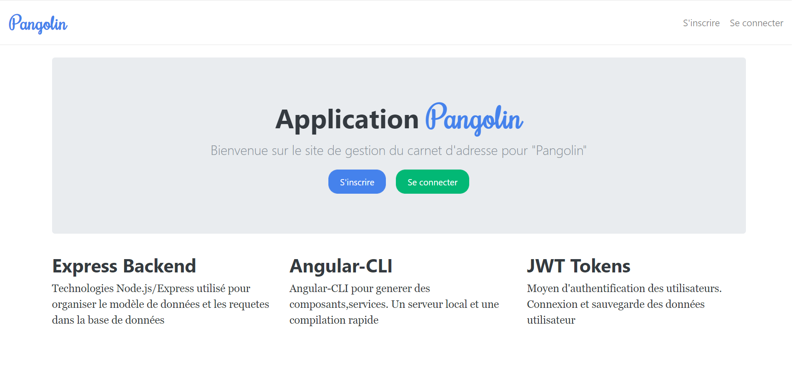
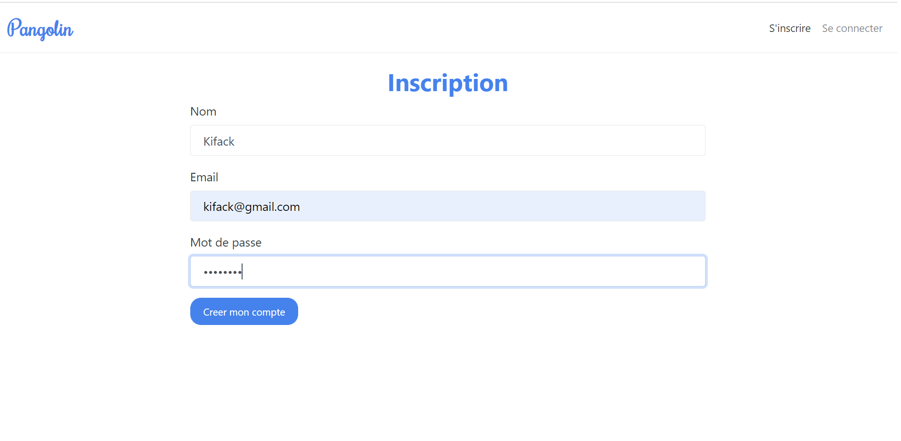
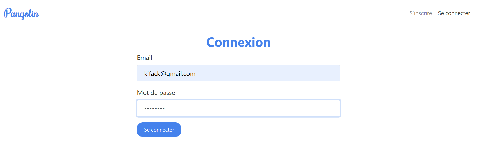
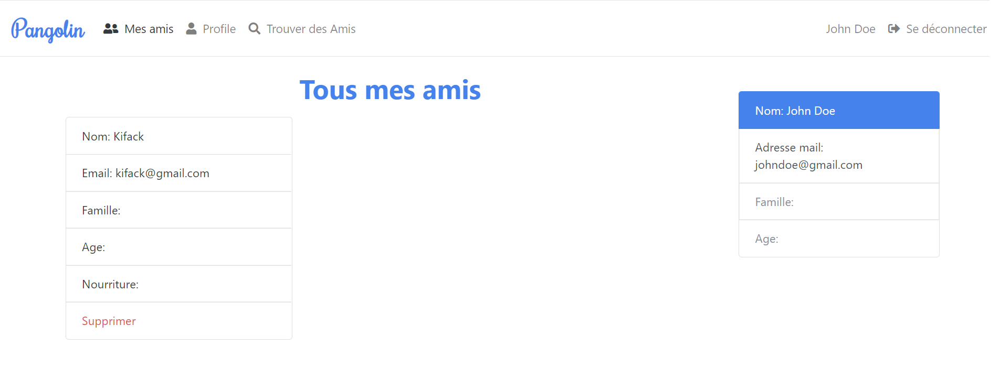

<h2>Application pangolin</h2>

    Création d'un mini carnet d'adresse "Pangolin" avec Angular et NodeJS, comportant les fonctionnalités suivantes

<ul>
    <li>(Inscription/Connexion/Déconnexion) du "Pangolin" par login/mot de passe </li>
    <li>(Afficher/Modifier) ses informations (age / famille / race / nourriture) </li>
    <li>(Ajouter/Supprimer) en amis un autre "Pangolin" parmi les autres Pangolins inscrits.</li>
</ul>

